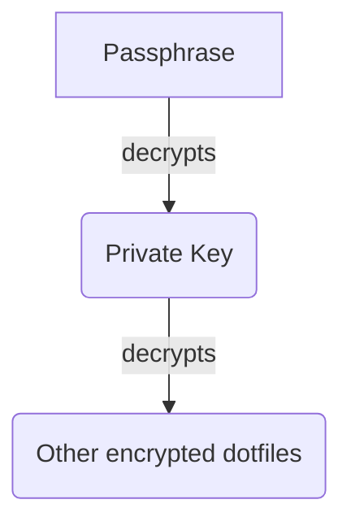

# `data/`

Supplemental data files used by my chezmoi configuration.

## `key.txt.age`

Some of my dotfiles are encrypted with
[`age`](https://github.com/FiloSottile/age), which is integrated into chezmoi.

Chezmoi can encrypt and decrypt these files using a private key file in this
repository. This private key itself is passphrase-encrypted (also with `age`).
See 1Password for its value.

This process is explained at the
[chezmoi documentation](https://www.chezmoi.io/user-guide/frequently-asked-questions/encryption/).
The important part of this technique is that the passphrase is only prompted the
first time chezmoi init is run.

## `gpg-keys.txt.age`

age-encrypted file containing my GPG keys that will be imported by chezmoi
scripts.

## `packagelists/`

YAML files listing packages to be installed by my chezmoi scripts. See
[`the installation script`](/home/.chezmoiscripts/after/run_after_10-install-paru-packages.sh) for usage.
