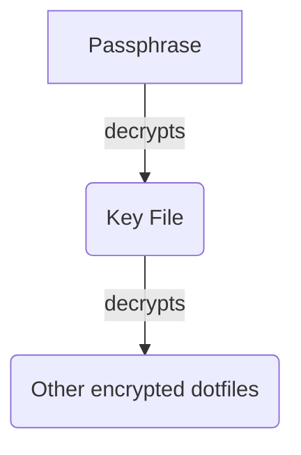

# `data/`

Supplemental data files used by my chezmoi configuration.

## `key.txt.age`

Some of my dotfiles are encrypted with
[`age`](https://github.com/FiloSottile/age), which is integrated into chezmoi.

Chezmoi can encrypt and decrypt these files using a key file in this repository.
This key itself is passphrase-encrypted (also with `age`). See 1Password for its
value.

```mermaid
flowchart TD
    A[Passphrase] -->|decrypts| B(Key File)
    B --> |decrypts| C(Other encrypted dotfiles)

```

This process is explained at the
[chezmoi documentation](https://www.chezmoi.io/user-guide/frequently-asked-questions/encryption/).
The important part of this technique is that the passphrase is only prompted the
first time `chezmoi init` is run, and subsequent runs will use the decrypted key
at `.config/chezmoi/key.txt`.

## `gpg-keys.txt.age`

My GPG keys that will be imported, age-encrypted.

## `packagelists/`

YAML files listing packages to be installed by my chezmoi scripts. See
[the installation script](/home/.chezmoiscripts/run_after_script.py) for usage.

Format is a YAML list of unique package names.
